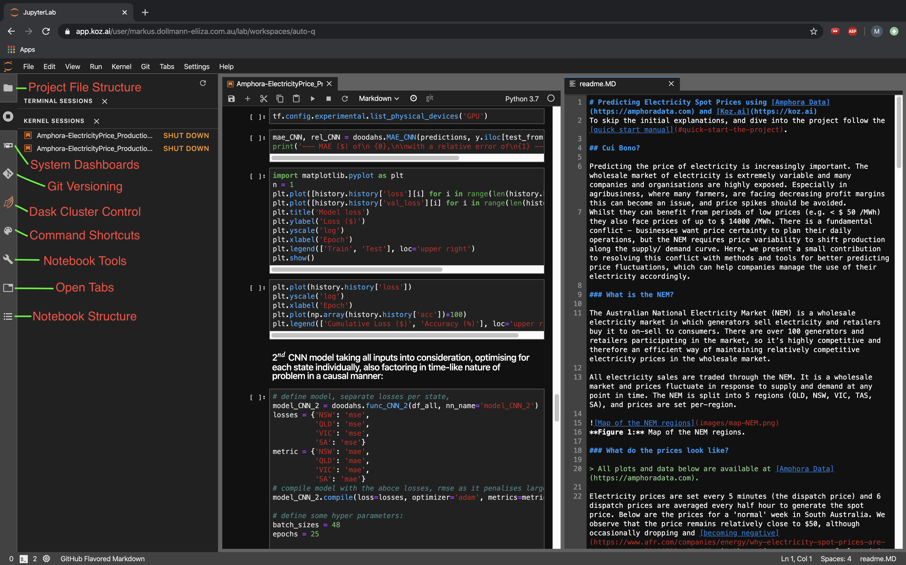

# Predicting Electricity Spot Prices using [Amphora Data](https://amphoradata.com) and [Kozai](https://koz.ai)
 > To skip the initial explanations, and dive into the project follow the [quick start manual](#quick-start-the-project).

In South Australia, electricity is predominantly sourced from renewable energy sources such as sun and wind. As both wind speeds and sun insolation vary greatly, so do electricity prices. In an effort to model the electricity spot price spikes in South Australia, data from the [Amphora Data](https://amphoradata.com) agricultural data repository was ingested into the [Kozai](https://koz.ai) data science platform for modelling and predictions, resulting in a good predictor for price spikes based on a convolutional neural net.

## Who we are

### Better data, and more of it

Accurate predictions, especially in forecasting problems, require large amounts of data. Making a prediction on something not seen before by the model, will be difficult in most situations. Often, more data is not sufficient though, and other data, other variables help to improve model performance. 

**Amphora Data** is a platform to discover, package, and trade data relevant to agriculture, either in real-time, or historical. An Amphora is an abstraction on data that allows us to generalise on it's contents. Each Amphora generally contains a small but useful dataset that is consistently being updated. Amphorae provide a standard interface to describing, accessing, and monetising data so that each additional data source is easier to include than the last.

The screenshot below shows the Amphora web application displaying metadata from a Meat and Livestock Australia data feed. In fact, any organisation on Amphora Data can create and trade arbitrary data as they like, and the number of Amphorae is growing consistently. All the data used in this project are available at [beta.amphoradata.com](https://beta.amphoradata.com)


**Figure 1:** Screenshot of the Amphora Data web app.

Amphora Data also provides Python (as used in this project), and Dotnet SDKs, and an API specification, so you can integrate data into your own applications or data science tools and processes.

Amphora Data is currently in private beta. For access visit [amphoradata.com/contact-us](https://amphoradata.com/contact-us)

###  Simplify Data Science with [Kozai](https://koz.ai)
**Kozai** is a serverless self-service cloud environment for easy, simplified data science development and deployment. 
With more data and larger projects, local compute power will soon become limiting and correspondingly waiting times will increase. [Kozai](https://koz.ai) offers the solution to computers overheating and fans reaching the noise level of a vacuum cleaner! It allows you to scale your projects easily from a single CPU, or GPU, to an entire cluster for plentiful compute power.
Also, the built-in git support makes version control simple and allows for easy collaboration on a project. 
Thus, Kozai makes moving between different work locations easy, removes issues with fickle updates of environments and packages, as the Kozai environment is identical, irrespective of where you log in from, or which of your users log in. 

Kozai offers the perfect platform for projects like the one described here, while also being reasonably priced and even offering a pay-as-you-go model.


**Figure 2:** The Kozai UI, with labels showing some key intrinsic features.

Kozai is currently in the private beta phase, going into public beta in Q2 2020. To register to the mailing list for information and updates visit [https://koz.ai](https://koz.ai).

## Electricity Spot Prices in South Australia

Predicting the price of electricity is increasingly important. The wholesale market of electricity is extremely variable and many companies and organisations are highly exposed. This is an issue in agribusiness, where many farmers are facing decreasing profit margins and price spikes can cause great difficulties.
While farmers can benefit from periods of prices as low as $50 /MWh or even less, they also face prices of up to $14000 /MWh. There is a fundamental conflict - businesses want price certainty to plan their daily operations, but the Australian National Electricity Market (NEM) requires price variability to shift production along the supply/demand curve. Here, we present a small contribution to resolving this conflict with methods and tools for better predicting price fluctuations, which can help companies manage the use of their electricity accordingly.

### What is the NEM?

The Australian National Electricity Market (NEM) is a wholesale electricity market in which generators sell electricity and retailers buy it to sell on to consumers. There are over 100 generators and retailers participating in the market, so it’s highly competitive and therefore an efficient way of maintaining relatively competitive electricity prices in the wholesale market.

All electricity sales are traded through the NEM. It is a wholesale market and prices fluctuate in response to supply and demand at any point in time. The NEM is split into 5 regions (QLD, NSW, VIC, TAS, SA), and prices are set per-region.


**Figure 3:** Map of the NEM regions: South Australia (grey), Victoria (green), Tasmania (red), New South Wales (blue), and Queensland (yellow).

### What do the prices look like?

> All plots and data below are available at [Amphora Data](https://amphoradata.com).

Electricity prices are set every 5 minutes (the ‘dispatch price’) and 6 dispatch prices are averaged every half hour to generate the ‘spot price’. Below are the prices for an arbitrary week in South Australia. We observe that the price remains relatively close to $50, although occasionally dropping sharply and [becoming negative](https://www.afr.com/companies/energy/why-electricity-spot-prices-are-hitting-zero-20190723-p52a08). At these times, consumers of electricity are actually paid to consume.


**Figure 4:** Normal electricity price and scheduled generation in a week for SA.

Now compare the 'normal' week above, to the week that immediately followed it in December of 2019. Clearly things are very different. The 'normal' variability ~$50 is no longer visible, as the graph is dominated by a huge spike on December 19, when the price jumped to over $8,000, approximately two orders of magnitude larger than the maximum for the days either side. We also observe that the maximum scheduled generation has doubled compared with the previous week. 

**Figure 5:** Abnormal electricity price and scheduled generation in a week for SA.

So what's going on? A major driver of electricity demand (and therefore supply) is the weather. The plot of temperature below shows that Adelaide was experiencing a serious heatwave from December 17 to December 20, with the price spike occurring the evening before the hottest and last day. Keen observers will also note that the minimum overnight temperature was high at 28 degrees.

We've highlighted the same period for each day of the heatwave (7 - 9 pm), which coincides with the price spike on the last day. Temperatures are significant, because higher temperatures mean more air-conditioning (i.e. greater consumption) and often less efficient power plants. Wind speed is also significant because of the high use of wind energy in South Australia.


**Figure 6:** Temperature and wind speed during abnormal week for SA.

### Counting the cost

If your business was regularly running a plant at 7pm, and that plant consumes ~250 kW of power, on a normal day you'd spend about $15/hour to run the plant. Compare that to the abnormal day on December 19. On that day, at 7pm, you'd spend $1,500 in a single hour!

### Why hasn't this happened to me?

Luckily for regular consumers, electricity retailers (think AGL, Origin etc.) protect you from price variability by hedging against shortfalls in generation. Therefore, no ridiculously expensive days. Consumers *are* paying for the price spikes, it's just averaged out over the entire year.

### So why would anyone want to be exposed to the variable price?

Remember that during the normal week of operations, the price actually went negative, meaning that anyone exposed and consuming electricity during that period was actually paid by the market. For our imaginary business, for the hour when price dropped to $-30, they would have actually been paid about $7 to run their plant - a $22 improvement on the typical situation.

You may also wish to be exposed if you have atypical usage patterns, because as long as you don't consume during periods of high prices, your total electricity bill will be significantly smaller because you aren't paying a retailer to hedge the market for you.

### How to manage costs when exposed to the wholesale price

Best case scenario, you need an automated and robust prediction of the price, and an automated go/no-go decision framework. [Amphora Data](https://amphoradata.com) and [Kozai](https://koz.ai) have partnered to develop an open source tool for achieving just that. We hope you find it useful :)

# Code and Data

## Quick start

To get started with the project, follow these steps to get set up:

1. Run `git clone https://github.com/1112114641/amphoradata-ElectricityForecast.git` in kozai terminal, or download from github `https://github.com/1112114641/amphoradata-ElectricityForecast` and then manually upload to kozai.
2. Run `cd 0_setup`, then execute `export usrname='[YourAmphoraUsernameHere]'`, and `export password='[YourAmphoraPasswordHere]'` to set the amphora data password and username.
3. Run `conda env create -f EForecast.yml` to setup the environment, install python packages and then activate the environment with `conda activate EForecast`.
4. Check that the variables $usrname and $password are set, so that the connection to amphora API is possible. To test this, run `echo $usrname` or `echo $password` in your terminal shell.
5. Open `Amphora-ElectricityPrice_Production.ipynb` in the base directory, which is now ready to be run

### Wrapper around Amphora Data Python SDK

A wrapper [APIfetch.py](./1_modules/modules/APIfetch.py) for the Amphora Data API was created to help the eventual automation of the data download, forecasting and data upload.  The wrapper facilitates these three steps for users, only requiring them to state the desired dates and amphora, while taking care of everything else in the process.

## Into the Data Science

The project was started with some exploratory analysis of the downloaded spot prices and weather data from Amphora Data. As a proof-of-concept / baseline, a multiple linear regression model was then built to predict spot prices for electricity in South Australia (SA). These simple models often show a good performance in a wide range of situations and offer an indication of the importance of new features as they are added to the model. Then, more complex and involved models were developed and tested, measured against this baseline.

### Exploratory Data Analysis (EDA)

As a start, as in most of my projects, data was checked for completeness, and missing values were interpolated with splines. To capture the temporal nature of the data, new features were created consisting of the discrete t<sub>n</sub>-t<sub>n-1</sub> time differences. 

The correlations between the SA spot prices and all other variables were tested, yielding the result that the SA spot prices behave the most similar to the `scheduledGeneration` in Victoria (VIC) and SA. The next most correlated features were weather-related, namely those that influence solar cell and/or wind farm performance.

```
>>>corr_SA.price_SA.sort_values(ascending=False).head(10)
price_SA                   1.000000
scheduledGeneration_VIC    0.388196
scheduledGeneration_SA     0.369061
d_price_SA                 0.331827
rainProb_SA                0.225282
d_rainProb_SA              0.224557
d_windDirection_SA         0.215873
cloudCover_SA              0.207847
windDirection_SA           0.206184
d_cloudCover_SA            0.205422
Name: price_SA, dtype: float64
```
Data from the other states was included for the SA price modelling effort, as their electricity grids are connected, thus influencing each other.

Similarly, the prices in NSW and QLD follow a similar pattern of mutual dependence. In an analysis as for SA above, the dominant features are the respective `scheduledGeneration` for NSW and QLD, as expected in connected electricity markets. The small influence between SA/VIC on the one side, and QLD/NSW on the other, lies in their geographic separation, and different electricity generation sources.

Adjusting the linear model to contain only these top nine features already improved the performance, showing a about 30% lower mean square error (mse):
```
>>>print('RMSE with correlation features:', rmse_corr, '$/MWh\n')
RMSE with correlation features: 207.58 $/MWh
>>>print('RMSE w/o correlation features: ', rmse_plain, '$/MWh')
RMSE w/o correlation features:  281.23 $/MWh
```
For both the random forest regressor, as well as the deep learning models tested for model selection, a similar improvement in performance manifested using only these highly correlated features, or a similar selection of a subset of features.

#### Distribution of data

Especially for classical machine learning methods the distribution of data matters, where normal distributed data leads to faster algorithm convergence and better predictions. In this case, fortunately, most data was fairly close to either a shifted normal, or log-normal distribution as can be seen in a pairplot. Correspondingly, no data transformation was undertaken, although it is a possible improvement factor to consider for future modelling efforts.

### Feature engineering

The amount of data at the start of the project was limited in terms of typical forecasting applications, with less than 30 days worth of data available. As there was great variation in the performance of new features as fresh data came in daily, the creation of such features to help improve the modelling was not actively pursued to the later stages.

### Model selection

Often, the central question for data science is the choice of the model, where several competing factors have to be considered: explainability, model performance, model inference time, and model train time.
The latter two factors were not a concern for this specific project thanks to Kozai! Hence a variety of different models and architectures were tested, among them simple linear models (Lin), random forests (RFR), but also dense (NN_3), recurrent (RNN) and convolutional neural networks (CNN_2 and CNN_4). For all these models, the optimisation criterion was the mean square error (mse). This criterion was chosen as large outliers are undesirable and the mse is easily interpretable, if its square root is considered, as an error in units of $/MWh.
Each model was trained on features _x_, with the corresponding spot prices _y_ lagged by 1 to 24h, to be able to predict 1 to 24 timesteps into the future.
The reason for these 24h prediction windows is rapidly decreasing forecast quality for longer periods, and a more accurate prediction of the windows between 4-9pm, and 2-9am, where most price spikes occur.

The best performing model with the current amount of data (~45days) was a convolutional neural net (CNN_4) optimising by SA spot prices, as indicated by the overall minimal mse over the 24 prediction timesteps. This model yielded a standard error of 69 $/MWh for the SA spot price predictions. The second most accurate model with very similar performance optimised for each state concurrently (CNN_2).

```
>>>print(mse)
Lin: 	43091
RFR:	78459
RNN: 	13388
CNN_2:  12937
CNN_4: 4791
NN_3: 	59212
```

## Predictions


**Figure 7:** Predictions for some of the electricity spot price spikes in SA, focusing on two periods with many price negative and positive spot price spikes. The negative spot prices are not mapped well onto the predictions, whereas the positive spikes are well mapped.

Predictions made by this model showed to be good for the prediction of large trends in spot price, like spikes, if they cross a certain threshold. For the precise determination of spot prices, model performance tended to be off between $ 10-30, as visible from the two plots above in Figure 7.

On a Kozai single GPU instance, training the most accurate model was over 5.9x faster than on a 8 core CPU instance, ensuring a fast training and evaluation time.

## Final note

In time, given a larger amount of data (~1-2 years worth), feature engineering and more fine tuned models are likely to improve predictions from spot price spike prediction to levels, where the actual price at any point in time can be predicted more accurately.

For a larger amount of data, rare events like spot price spikes will then have to be more carefully modelled for, to ensure the models correct predictions, in order not to drown out these rare events. For this end, training can be specifically focussed on these, or artificial data can be created to "enrich the price spike data".

Focussing on the more regular day-to-day price variations, rebinning from 1h intervals into larger bins, e.g. 2, 4, 6h bins, can bring out further characteristics in the data and make it easier for the model to pick on different characteristics of the evolution and different parts of the signal, further improving model performance.

