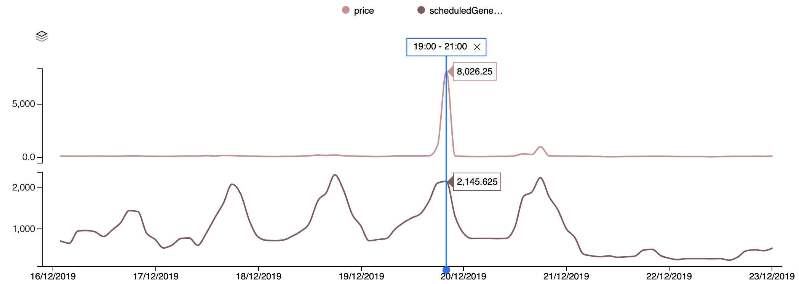
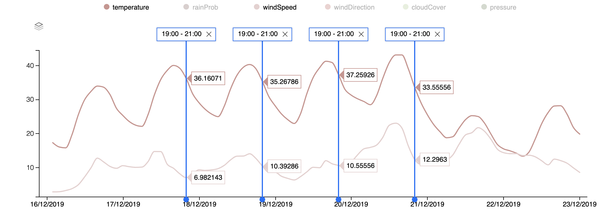

# Predicting Electricity Spot Prices using [Amphora Data](https://amphoradata.com) and [Koz.ai](https://koz.ai)
To skip the initial explanations, and dive into the project follow the [quick start manual](#quick-start-the-project).

## Cui Bono?

Predicting the price of electricity is increasingly important. The wholesale market of electricity is extremely variable and many companies and organisations are highly exposed. Especially in agribusiness, where many farmers, are facing decreasing profit margins this can become an issue, and price spikes should be avoided.
Whilst they can benefit from periods of low prices (e.g. < $ 50 /MWh) they also face prices of up to $ 14000 /MWh. There is a fundamental conflict - businesses want price certainty to plan their daily operations, but the NEM requires price variability to shift production along the supply/ demand curve. Here, we present a small contribution to resolving this conflict with methods and tools for better predicting price fluctuations, which can help companies manage the use of their electricity accordingly.

### What is the NEM?

The Australian National Electricity Market (NEM) is a wholesale electricity market in which generators sell electricity and retailers buy it to on-sell to consumers. There are over 100 generators and retailers participating in the market, so it’s highly competitive and therefore an efficient way of maintaining relatively competitive electricity prices in the wholesale market.

All electricity sales are traded through the NEM. It is a wholesale market and prices fluctuate in response to supply and demand at any point in time. The NEM is split into 5 regions (QLD, NSW, VIC, TAS, SA), and prices are set per-region.


**Figure 1:** Map of the NEM regions.

### What do the prices look like?

> All plots and data below are available at [Amphora Data](https://amphoradata.com).

Electricity prices are set every 5 minutes (the dispatch price) and 6 dispatch prices are averaged every half hour to generate the spot price. Below are the prices for a 'normal' week in South Australia. We observe that the price remains relatively close to $50, although occasionally dropping and [becoming negative](https://www.afr.com/companies/energy/why-electricity-spot-prices-are-hitting-zero-20190723-p52a08). At these times, consumers of electricity are actually paid to consume.


**Figure 2:** Normal electricity price and scheduled generation in a week for SA.

Now compare the 'normal' week above, to the week that immediately followed it in December of 2019. Clearly things are very different. The 'normal' variability ~$50 is no longer visible, as the graph is dominated by a huge spike on December 19, when the price jumped to over $8,000, approximately 2 orders of magnitude larger than the maximum for the days either side. We also observe that the maxiumum scheduled generation has doubled compared with the previous week. So what's going on?


**Figure 3:** Abnormal electricity price and scheduled generation in a week for SA.

A major driver of electricity demand (and therefore supply, as the two must be equal) is the weather. The plot of temperature below shows that Adelaide was experiencing a serious heatwave from December 17 to December 20, with the price spike occuring the evening before the hottest and last day. Keen observers will also note that the minimum overnight temperature was high at 28 degrees.

We've highlighted the same period for each day of the heatwave (7 - 9 pm), which coincides with the price spike on the last day. Temperatures are significant, because higher temperatures mean more air-conditioning (i.e. greater consumption) and often less efficient power plants. Wind speed is also significant (although not necessarily just in Adelaide) because of the high penetration of wind energy in South Australia.


**Figure 4:** Temperature and windspeed during abnormal week for SA.

### Counting the cost.

If your business was regularly running plant at 7pm, and that plant consumes ~250 kW of power, on a normal day you'd spend about $15/hour to run the plant. Compare that to the abnormal day on December 19. On that day, at 7pm, you'd spend $1,500 in a single hour!

### Why hasn't this happened to me?

Luckily for regular consumers, electricity retailers (think AGL, Origin etc.) protect you from price variability by hedging against shortfalls in generation. Therefore, no ridiculously expensive days. Consumers *are* paying for the price spikes, it's just averaged out over the entire year.

### So why would anyone want to be exposed to the variable price?

Remember that during the normal week of operations, the price actually went negative, meaning that anyone exposed and consuming electricity during that period was actually paid by the market. For our imaginary business, for the hour when price dropped to $-30, they would have actually been paid about $7 to run their plant - a $22 improvement on the typical situation.

You may also wish to be exposed because as long as you don't consume during periods of high prices, your total electricity bill will be significantly smaller because you aren't paying a retailer to hedge the market for you.

### How to manage costs when exposed to the wholesale price.

Best case scenario, you need an automated and robust prediction of the price, and an automated go/no-go decision framework. [Amphora Data](https://AmphoraData.com) and [Koz.ai](https://koz.ai) have partnered to develop this open source experimentation tool for achieving just that. We hope you find it useful :)

## Better data, and more of it.

For data science, and specifically for forecasting problems, accurate predictions require large amounts of data. Making a prediction on something not seen before by the model, will be difficult in most situations. Often, more data is not sufficient though, and other data, other variables help to improve model performance. 

Amphora Data is a platform to discover, package, and trade data relevant to agriculture, either in real-time, or historical. An Amphora is an abstraction on data that allows us to generalise on it's contents. Each Amphora generally contains a small but useful dataset that's consistently updating. Amphorae provide a standard interface to describing, accessing, and monetising data so that each additional datasource is easier to include than the last.

The screenshot below shows the Amphora web application displaying metadata from a Meat and Livestock Australia data feed. In fact, any organisation on Amphora Data can create and trade arbitrary data as they like, and the number of Amphora is growing consistently. All the data used in this project are available at [beta.amphoradata.com](https://beta.amphoradata.com)


**Figure 5:** Screenshot of the Amphora Data web app.

Amphora Data also provide Python (as seen in this project) and Dotnet SDKs, and an API specification, so you can integrate data into your own applications or data science tools and processes.

Amphora Data is currently in private beta. For access visit [amphoradata.com/contact-us](https://amphoradata.com/contact-us)

## Quick start the project

To get started with the project, follow these steps to get set up:

1. Run `git clone https://github.com/1112114641/amphoradata-ElectricityForecast.git` in kozai terminal, or download from github `https://github.com/1112114641/amphoradata-ElectricityForecast` and then manually upload to kozai
2. Run `cd 0_setup`, then execute `export usrname='yourAmphoraUsername'`, and `export password='yourAmphoraPassword'` to set the amphora data password and username in your terminal`
3. Run `conda env create -f EForecast.yml` to setup the environment, install python packages and then activate the env with `conda activate EForecast`
 - if a `permission denied` error occurs, change rights with `chmod a+x EForecast.yml` to make the file executable, run 3., then change back to base dir with `cd ..`
4. Take care to ensure the variables $usrname and $password are set, so connection to amphora API possible. To test this, run `echo $usrname` or `echo $password` in your shell
5. Open the `ipynb` file in the base directory, which is now ready to be run


###  Simplify ([Koz.ai](https://koz.ai)) your life

With more data and larger projects compute power will soon become to little and correspondingly waiting times will increase. [Koz.ai](https://koz.ai) offers the solution to computers running hot and fans reaching the noise level of a vacuum cleaner, allowing to easily scale your projects from single CPU, or GPU, to an entire cluster for plentiful compute power.
More importantly, with the built-in git support, versioning is simple and keeps your projects safe and allows for easy collaboration on a project. 
Thus, Koz.ai allows for the easy move between different work locations, obviating the need for fights with fickle updates of environments and packages, as the kozai environments is identical, irrespective of where you log in from, or who logs in. 

For a project like the eletricity spot price predictions here, Koz.ai offers the perfect platform, while being reasonably priced, even offering a pay as you go model.


**Figure 6:** Current state of the Kozai UI, with labels showing some of the Kozai intrinsic features.

<!--### Connecting e.g. VSCode to a kozai sesh
 follow e.g. [here](https://blog.ouseful.info/2019/02/11/connecting-to-a-remote-jupyter-notebook-server-running-on-digital-ocean-from-microsoft-vs-code/ "Connect VSCode to external Kernel")
-->

## Into the Data Science

The project was started with some exploratory data analysis (EDA), downloading spot prices and weather data from Amphora Data. As a proof of concept (POC), a multi-linear regression model was built, as these simple models often show a good performance in a wide range of situations, offering an indicator to the performance of new features added to the model, trying to predict spot prices for electricity in South Australia.

### Exploratory Data Analysis (EDA)

As a start, as in most of my projects, data was checked for completeness, and missing values were interpolated with splines. To hard code the time-like nature of the data, new features were created consisting of the discrete t<sub>n</sub>-t<sub>n-1</sub> time differences. 

The correlations between the SA spot prices and all other variables were tested, yielding the result that the SA spot prices behave the most similar to the `scheduledGeneration` in VIC and SA, with the next most important features being weather related, influencing solar cell and/or windfarm performance.

```
>>>corr_SA.price_SA.sort_values(ascending=False).head(10)
price_SA                   1.000000
scheduledGeneration_VIC    0.388196
scheduledGeneration_SA     0.369061
d_price_SA                 0.331827
rainProb_SA                0.225282
d_rainProb_SA              0.224557
d_windDirection_SA         0.215873
cloudCover_SA              0.207847
windDirection_SA           0.206184
d_cloudCover_SA            0.205422
Name: price_SA, dtype: float64
```
Comparing to the price's in NSW and QLD, a similar pattern emerges although the dominant features are the respective `scheduledGeneration` for NSW and QLD.

Tweaking the linear model to contain only these top 9 features already improved the performance, showing a lower mean square error (mse).
The random forest regressor also showed much improved performance using these correlation features.

For the deep learning models, in a similar manner, a reduced subset of all variables was used for model training and inference.

### Wrapper around Amphora Data Python SDK

To allow for eventual automation of the data download, forecasting and data upload, a Python wrapper [APIfetch.py](./1_modules/modules/APIfetch.py) around the [Python SDK](https://github.com/amphoradata/python-sdk) for the Amphora Data API was created.  The wrapper allows for facile data management, only requiring to state the desired dates and amphora, taking care of everything else.

### Feature engineering

As the amount of data at the start of the project was limited in terms of data science standards, with less than 30 days worth of data, performance of new features showed a great variation from day to day, as new data came in. Correspondingly, creation of such features helping to improve the model was not actively pursued to the later stages.

### Model selection

Often, the central question for data science is the choice of the model, where several competing factors have to be considered: explainability, model performance, model inference time, and model train time.
For this specific project, where thanks to Kozai the latter two were not a concern, a variety of differnt models and architectures were tested, among them simple linear models, random forests, but also dense neural nets, and recurrent, and convolutional neural nets. For all these models,the optimisation criterion was the mean square error (mse), as large errors are undesired here, and it is easily interpretable if the root of the mse is considered, yielding an error in $.
Each model was trained on features _x_, with the corresponding spot prices lagged by 1 to 12h, to be able to predict for 1 to 24 timesteps into the future.
The reason for these 24h prediction windows is rapidly decreasing forecast quality for longer periods, and a more accurate prediction of the windows between 4-9pm, and 2-9am, where most price spikes occur.

The best performing model with the current amount of data (~45days) was a convolutional neural net (CNN) optimising by SA spot prices, as indicated by the overal minimal mean mse over the 24 prediction timesteps. The second most accurate model with very similar performance optimised for each state concurrently.

The best model performance for final predictions was confirmed by comparing the mean mse over the 24 predicted values for all models and architectures.

## Predictions


**Figure 7:** Predictions for some of the electricity spot price spikes in SA, focussing on two periods with many price negative and positive spot price spikes. The negative spot prices are not mapped well onto the predictions, whereas the positive spikes are well mapped.

Predictions made by this model showed to be good for the prediction of large trends in spot price, like spikes if they crossing a certain treshold. For the precise determination of spot prices, model performance tended to be off between $ 5-20, as visbile from the two plots above in Figure 7.

On a Kozai single GPU instance, training the most accurate model was over 5.9x faster than on a 8 core CPU instance, ensuring a fast training and evaluation time.
<!-- 2x4 grid of date (4x) vs ((QLD,NSW, True),((VIC,SA,True)))-->

## Final note

In time, given a larger amount of data (~1-2 years worth), feature engineering and more fine tuned models, are likely to improve predictions from spot price spike prediciton to levels, where the actual price at a point in time can be predicted.

For a larger amount of data, rare events like spot price spikes will then have to be more carefully modelled for, to ensure the models correct predictions, in order not to drown out these rare events. For this end, training can be specifically focussed on these, or artifical data can be created to "enrich the price spike data".

Focussing on the more regular day-to-day price variations, rebinning from 1h intervals into larger bins, e.g. 2,4,6h bins, can bring out further characteristics in the data and make it easier for the model to pick on different characteristics of the evolution and different parts of the signal, further improving model performance.